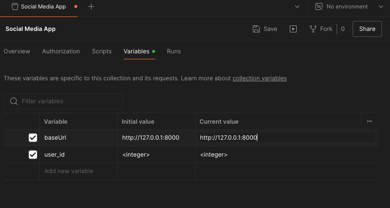

# Social Media API Postman Collection Guide

This README provides instructions on how to import and use the Postman collection to test the API endpoints defined in this FastAPI application.

## 🛠️ Prerequisites

Before using this Postman collection, make sure you have the following installed:

- Postman: Download Postman
- Running FastAPI Application: Your FastAPI app should be running locally or deployed to a server.

## 🚀 Import the Collection

- Open Postman and click the "Import" button (top-left).
- Choose the "File" tab and upload the saved social_media_api_collection.json file.
- Postman will create a collection with all your FastAPI endpoints.

## 📚 Troubleshooting

404 Errors: Make sure the FastAPI app is running and that the endpoint paths are correct.
Connection Issues: Ensure that Postman is pointing to the correct server address (local or remote).

## 🔐 Authentication

Check on the main README file on which endpoints needs authentication
- Open the request in Postman.
- Go to the Authorization tab.
- Choose the appropriate authentication method Bearer Token and input the necessary credentials.

Replace the {{baseURL}} inital and current value with http://127.0.0.1:8000

